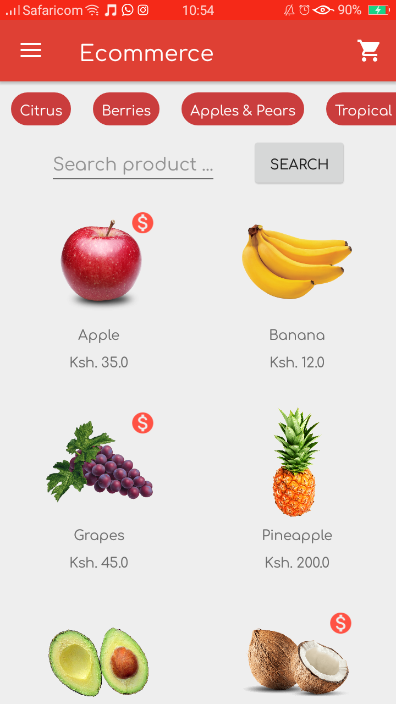
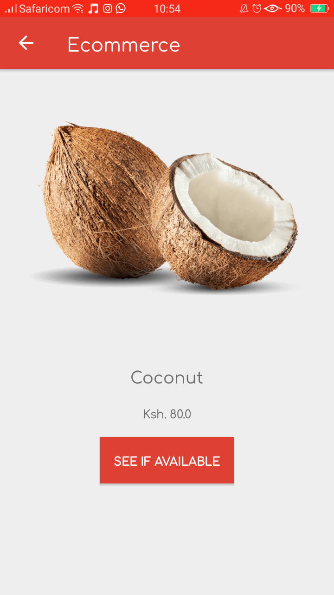
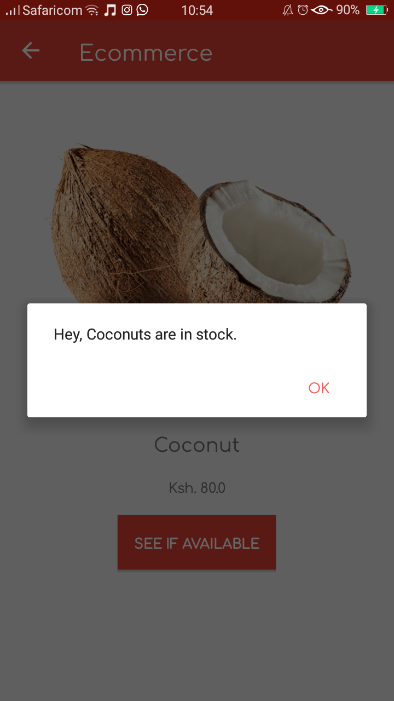
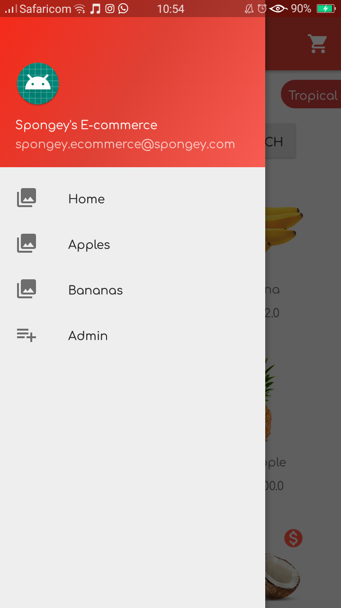
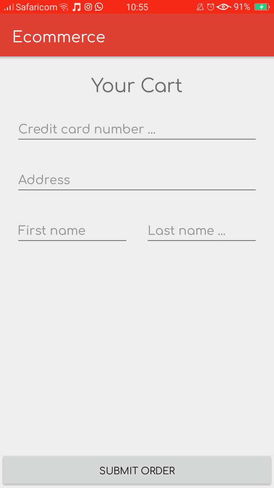

# Ecommerce
This is a simple grocery store application that shows differnt fruits one can purschase, their cost and whether or not they are in stock.

## Play Store
The demo of the app can be found [here](https://play.google.com/store/apps/details?id=com.spongey.ecommerce)

## Screenshots

 

